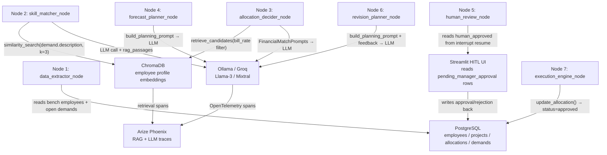
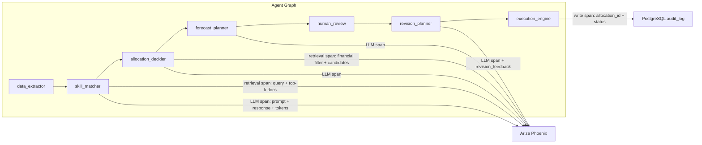
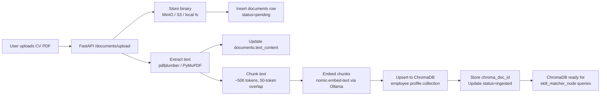

# Bench Forecast — Database & Data Sourcing Plan (v2)

## Current State Assessment

The agent workflow in [`nodes.py`](file:///Users/dariusmuntean/Documents/aiAcademy/Project/Bench-Forecast/bench_forecast/src/agents/nodes.py) is far more advanced than the original MVP description. It already implements a **7-node LangGraph graph** with ChromaDB-backed RAG, a `RAGPipeline` with financial pre-filtering, Pydantic-validated `AllocationDecision` outputs, a full HITL `human_review_node` with `interrupt_before`, a `revision_planner_node` for feedback-driven re-planning, and a deterministic `execution_engine_node`. The data layer must be designed to serve this graph, not replace it.

> [!IMPORTANT]
> This v2 plan corrects five issues from v1: vector store architecture, LLM provider, HITL schema, observability, and RAGAS/KPI tracking. All Gemini references are removed. The plan is written to align with the **existing 7-node agent graph**.

---

## Correction Summary

| Issue | v1 (Wrong) | v2 (Correct) |
|---|---|---|
| Vector store | pgvector in PostgreSQL | **ChromaDB** (already used in `nodes.py`) |
| Embeddings | Gemini Embedding API | **`nomic-embed-text` via Ollama** (open-source, zero-cost) |
| LLM provider | Gemini | **Ollama local** (Llama-3/Gemma/Mistral) or **Groq free tier** |
| Seed data generation | Gemini prompts | **Ollama local** LLM |
| HITL schema | No AI-proposal states | `proposed_by_ai`, `pending_manager_approval`, `approved_by_manager`, `rejected_by_manager` |
| Observability | Custom SQL `audit_log` only | `audit_log` for CRUD + **Arize Phoenix** for agent/RAG/LLM traces |
| KPIs | Business metrics only | + **RAGAS metrics** (faithfulness, relevance) + **MTTR**, **human intervention %** |

---

## 1. Stack & Technology Choices

```
Backend:
  Python 3.11+
  FastAPI
  SQLAlchemy 2.0 + Alembic (relational data)
  LangGraph + LangChain (existing agent graph — keep as-is)
  pdfplumber / PyMuPDF (PDF text extraction)
  ReportLab / FPDF (synthetic CV PDF generation)

LLM Providers (zero-cost, open-source):
  Ollama (local)  — llama3, gemma2, mistral, nomic-embed-text
  Groq free tier  — llama-3.1-70b-versatile, mixtral-8x7b (fallback)

Vector Store:
  ChromaDB (persistent mode) — already wired into VectorStoreManager + RAGPipeline

Relational Database:
  PostgreSQL 16

Document Storage:
  MinIO (dev) / S3-compatible (prod) for binary files

Observability:
  Arize Phoenix — agent traces, RAG spans, LLM calls (via OpenTelemetry / LangChain callbacks)
  Standard Python logging — node-level ENTRY/EXIT (already implemented)

Frontend:
  React + TypeScript + Vite (existing)
  Streamlit (HITL approval UI — existing pattern, per requirements)

Infrastructure:
  Docker Compose: PostgreSQL + ChromaDB + MinIO + Arize Phoenix + API
```

---

## 2. How the Agent Graph Connects to the Data Layer



> [!NOTE]
> The graph is kept **unchanged** for now. The database schema is designed to be the source of truth that `data_extractor_node` reads from and `execution_engine_node` writes to. ChromaDB is populated separately (via the document ingestion pipeline) and queried by `VectorStoreManager` and `RAGPipeline`.

---

## 3. Full Database Schema

### 3.1 Core HR Domain

#### `departments`
| Column | Type | Notes |
|---|---|---|
| `id` | UUID PK | |
| `name` | VARCHAR(200) | e.g. "Engineering", "Data Science" |
| `cost_center_code` | VARCHAR(50) | Links to finance/ERP |
| `head_count_budget` | INTEGER | Approved headcount |
| `created_at` / `updated_at` | TIMESTAMPTZ | |

#### `employees`
| Column | Type | Notes |
|---|---|---|
| `id` | UUID PK | |
| `employee_number` | VARCHAR(50) UNIQUE | Corporate ID (e.g. "EMP-00142") |
| `first_name` / `last_name` | VARCHAR(100) | |
| `email` | VARCHAR(255) UNIQUE | |
| `department_id` | UUID FK → departments | |
| `job_title` | VARCHAR(200) | e.g. "Senior Data Engineer" |
| `experience_level` | ENUM | `junior`, `mid`, `senior`, `lead`, `principal` |
| `hire_date` | DATE | |
| `employment_type` | ENUM | `full_time`, `part_time`, `contractor` |
| `location` | VARCHAR(200) | Office/region |
| `manager_id` | UUID FK → employees | Self-referencing org tree |
| `bench_status` | ENUM | `on_project`, `bench`, `upcoming_bench`, `internal`, `on_leave` |
| `bench_start_date` | DATE | NULL if on project |
| `utilization_rate` | DECIMAL(5,2) | Rolling % (0-100) |
| `profile_text` | TEXT | Concatenated profile for ChromaDB ingestion (skills, title, summary) |
| `avatar_url` | VARCHAR(500) | |
| `is_active` | BOOLEAN | Soft-delete flag |
| `created_at` / `updated_at` | TIMESTAMPTZ | |

> [!NOTE]
> `profile_text` is the denormalized text blob that gets chunked and embedded into ChromaDB by the ingestion pipeline. It replaces the old `cv_summary` string and is distinct from the actual PDF stored in `documents`.

#### `skills`
Normalized skill taxonomy — prevents "React" vs "ReactJS" vs "react.js" fragmentation.

| Column | Type | Notes |
|---|---|---|
| `id` | UUID PK | |
| `name` | VARCHAR(200) UNIQUE | Canonical name |
| `category` | VARCHAR(100) | e.g. "Frontend", "Cloud", "Data", "Soft Skills" |
| `is_verified` | BOOLEAN | Admin-approved |

#### `employee_skills`
| Column | Type | Notes |
|---|---|---|
| `employee_id` | UUID FK | |
| `skill_id` | UUID FK | |
| `proficiency_level` | ENUM | `beginner`, `intermediate`, `advanced`, `expert` |
| `years_experience` | DECIMAL(4,1) | |
| `last_used_date` | DATE | Skill freshness signal |
| `is_primary` | BOOLEAN | Top skills vs. secondary |
| PK | (employee_id, skill_id) | |

#### `certifications`
| Column | Type | Notes |
|---|---|---|
| `id` | UUID PK | |
| `employee_id` | UUID FK | |
| `name` | VARCHAR(300) | e.g. "AWS Solutions Architect" |
| `issuing_org` | VARCHAR(200) | |
| `issue_date` / `expiry_date` | DATE | |
| `credential_url` | VARCHAR(500) | |
| `document_id` | UUID FK → documents | Scanned cert PDF |

#### `documents` (CVs, certs, contracts — binary file metadata)

> [!IMPORTANT]
> **No `embedding` column here.** Embeddings live in ChromaDB. This table stores file metadata and links back to the ChromaDB document via `chroma_doc_id`.

| Column | Type | Notes |
|---|---|---|
| `id` | UUID PK | |
| `employee_id` | UUID FK | |
| `document_type` | ENUM | `cv`, `certification`, `contract`, `performance_review`, `training_record` |
| `file_name` | VARCHAR(500) | Original filename |
| `file_path` | VARCHAR(1000) | Object store path (e.g. `s3://bench-docs/cv/emp-142/resume_v3.pdf`) |
| `mime_type` | VARCHAR(100) | `application/pdf`, `image/png`, etc. |
| `file_size_bytes` | BIGINT | |
| `version` | INTEGER | CV revision number |
| `is_current` | BOOLEAN | Latest version flag |
| `text_content` | TEXT | Extracted text (pdfplumber) — source for ChromaDB ingestion |
| `chroma_doc_id` | VARCHAR(255) | ChromaDB document ID — links metadata here to vector chunks there |
| `ingestion_status` | ENUM | `pending`, `ingested`, `failed` — ChromaDB ingestion state |
| `uploaded_at` | TIMESTAMPTZ | |
| `uploaded_by` | UUID FK → users | |

---

### 3.2 Project & Staffing Domain

#### `clients`
| Column | Type | Notes |
|---|---|---|
| `id` | UUID PK | |
| `name` | VARCHAR(300) | |
| `industry` | VARCHAR(200) | |
| `account_manager_id` | UUID FK → employees | |
| `contract_type` | ENUM | `time_and_materials`, `fixed_price`, `retainer`, `internal` |
| `is_active` | BOOLEAN | |

#### `projects`
| Column | Type | Notes |
|---|---|---|
| `id` | UUID PK | |
| `name` | VARCHAR(300) | |
| `client_id` | UUID FK → clients | |
| `status` | ENUM | `pipeline`, `proposal`, `planned`, `active`, `on_hold`, `completed`, `cancelled` |
| `start_date` / `end_date` | DATE | |
| `planned_start` / `planned_end` | DATE | Original plan vs. actuals |
| `team_size_target` | INTEGER | |
| `priority` | ENUM | `low`, `medium`, `high`, `critical` |
| `description` | TEXT | |
| `probability_pct` | INTEGER | Win probability 0–100 |
| `created_at` / `updated_at` | TIMESTAMPTZ | |

#### `project_demands` (open roles the agent tries to fill — fed to `data_extractor_node`)
| Column | Type | Notes |
|---|---|---|
| `id` | UUID PK | |
| `project_id` | UUID FK → projects | |
| `role` | VARCHAR(200) | e.g. "Senior ML Engineer" |
| `description` | TEXT | Narrative description — used as ChromaDB query text |
| `required_skills` | JSONB | `["Python", "PyTorch", "MLOps"]` |
| `min_proficiency` | ENUM | Minimum skill level |
| `headcount_needed` | INTEGER | |
| `target_bill_rate` | DECIMAL(10,2) | What client will pay (per hour) — used by `allocation_decider_node` |
| `target_margin` | DECIMAL(5,2) | Desired gross margin % |
| `win_probability` | DECIMAL(5,4) | Propagated from project |
| `status` | ENUM | `open`, `filled`, `cancelled` |
| `needed_by_date` | DATE | Deadline for fulfillment — feeds MTTR calculation |
| `created_at` | TIMESTAMPTZ | |

#### `project_skill_requirements`
| Column | Type | Notes |
|---|---|---|
| `project_id` | UUID FK | |
| `skill_id` | UUID FK | |
| `min_proficiency` | ENUM | |
| `headcount_needed` | INTEGER | |
| `is_mandatory` | BOOLEAN | |
| PK | (project_id, skill_id) | |

#### `allocations` — **Updated for HITL state machine**

> [!IMPORTANT]
> The `status` ENUM is the core HITL state machine. The agent (`allocation_decider_node`) writes `proposed_by_ai` rows. The Streamlit UI reads these and lets the manager approve or reject. Only `execution_engine_node` writes `approved_by_manager` after `human_review_node` fires.

| Column | Type | Notes |
|---|---|---|
| `id` | UUID PK | |
| `employee_id` | UUID FK | |
| `project_id` | UUID FK | |
| `demand_id` | UUID FK → project_demands | Which demand triggered this |
| `role_on_project` | VARCHAR(200) | |
| `allocation_pct` | DECIMAL(5,2) | 50% = half-time |
| `start_date` / `end_date` | DATE | |
| `status` | ENUM | `proposed_by_ai`, `pending_manager_approval`, `approved_by_manager`, `rejected_by_manager`, `active`, `completed`, `cancelled` |
| `ai_justification` | TEXT | LLM reasoning from `AllocationDecision.justification` |
| `ai_match_score` | DECIMAL(5,4) | From `MatchJustification.match_score` |
| `ai_projected_margin` | DECIMAL(5,2) | From `AllocationDecision.projected_margin` |
| `ai_upskilling_path` | TEXT | From `AllocationDecision.upskilling_path` |
| `manager_notes` | TEXT | Manager edits/feedback on rejection |
| `forecast_run_id` | UUID FK → forecast_runs | Which run proposed this |
| `created_by` | UUID FK → users | |
| `approved_by` | UUID FK → users | NULL until approved |
| `approved_at` | TIMESTAMPTZ | |
| `created_at` / `updated_at` | TIMESTAMPTZ | |

> [!NOTE]
> An employee can have **multiple overlapping allocations** at partial percentages (e.g. 60% Project A + 40% Project B). Utilization = Σ active `allocation_pct`. Only `approved_by_manager` or `active` rows count toward utilization.

---

### 3.3 HITL Events Table

#### `hitl_review_events`
Logs every human decision for HITL KPI tracking (human intervention %, revision cycles).

| Column | Type | Notes |
|---|---|---|
| `id` | UUID PK | |
| `forecast_run_id` | UUID FK → forecast_runs | |
| `allocation_id` | UUID FK → allocations | |
| `reviewer_id` | UUID FK → users | |
| `decision` | ENUM | `approved`, `rejected`, `edited_then_approved` |
| `revision_number` | INTEGER | 0 = first review, 1 = after first revision, etc. |
| `rejection_feedback` | TEXT | Manager's rejection reason |
| `time_to_decision_seconds` | INTEGER | How long the manager took to review |
| `reviewed_at` | TIMESTAMPTZ | |

---

### 3.4 Financial Domain

#### `employee_costs`
| Column | Type | Notes |
|---|---|---|
| `id` | UUID PK | |
| `employee_id` | UUID FK | |
| `effective_date` | DATE | When this rate starts |
| `annual_salary` | DECIMAL(12,2) | |
| `currency` | VARCHAR(3) | ISO 4217 |
| `internal_daily_cost` | DECIMAL(10,2) | Fully loaded (salary + benefits + overhead) |
| `internal_hourly_cost` | DECIMAL(8,2) | `internal_daily_cost / 8` — for `allocation_decider_node` cost filter |
| `overhead_multiplier` | DECIMAL(4,2) | e.g. 1.35 |
| `created_at` | TIMESTAMPTZ | |

#### `project_financials`
| Column | Type | Notes |
|---|---|---|
| `id` | UUID PK | |
| `project_id` | UUID FK | |
| `billing_type` | ENUM | `time_and_materials`, `fixed_price`, `internal` |
| `client_daily_rate` | DECIMAL(10,2) | What client pays per person-day |
| `budget_total` | DECIMAL(14,2) | |
| `budget_consumed` | DECIMAL(14,2) | |
| `currency` | VARCHAR(3) | |
| `effective_date` | DATE | |

#### `bench_costs` (derived — money burned while on bench)
| Column | Type | Notes |
|---|---|---|
| `id` | UUID PK | |
| `employee_id` | UUID FK | |
| `period_start` / `period_end` | DATE | |
| `bench_days` | INTEGER | |
| `daily_cost` | DECIMAL(10,2) | |
| `total_cost` | DECIMAL(12,2) | bench_days × daily_cost |
| `currency` | VARCHAR(3) | |
| `calculated_at` | TIMESTAMPTZ | |

> [!WARNING]
> **Bench cost is the financial core.** Senior engineer at \$800/day loaded cost × 30 bench days = \$24,000 burned. The agent's entire purpose is to minimize this number through proactive AI-driven staffing.

---

### 3.5 Forecasting, History & KPIs

#### `bench_history`
| Column | Type | Notes |
|---|---|---|
| `id` | UUID PK | |
| `employee_id` | UUID FK | |
| `bench_start` | DATE | |
| `bench_end` | DATE | NULL = still on bench |
| `duration_days` | INTEGER | |
| `reason` | ENUM | `project_ended`, `project_cancelled`, `new_hire`, `returned_from_leave`, `client_decision` |
| `resolution` | ENUM | `assigned_to_project`, `internal_work`, `training`, `terminated`, `still_bench` |
| `notes` | TEXT | |

#### `forecast_runs` — **Expanded for RAGAS + KPIs**
| Column | Type | Notes |
|---|---|---|
| `id` | UUID PK | |
| `run_date` | TIMESTAMPTZ | |
| `forecast_horizon_days` | INTEGER | 30 / 60 / 90 |
| `model_version` | VARCHAR(100) | e.g. `llama3:8b` / `mixtral-8x7b-groq` |
| `embedding_model` | VARCHAR(100) | e.g. `nomic-embed-text` |
| `parameters` | JSONB | horizon, min_win_probability, etc. |
| `summary` | JSONB | Aggregated result: # reallocations, # hirings, total_bench_risk |
| `triggered_by` | UUID FK → users | |
| `phoenix_trace_id` | VARCHAR(255) | Arize Phoenix root trace ID for this run |
| `ragas_faithfulness` | DECIMAL(5,4) | RAGAS: did LLM stick to retrieved context? |
| `ragas_answer_relevance` | DECIMAL(5,4) | RAGAS: is the recommendation relevant? |
| `ragas_context_recall` | DECIMAL(5,4) | RAGAS: did retrieval cover needed info? |
| `ragas_evaluated_at` | TIMESTAMPTZ | When RAGAS scores were computed |

#### `bench_predictions`
| Column | Type | Notes |
|---|---|---|
| `id` | UUID PK | |
| `forecast_run_id` | UUID FK | |
| `employee_id` | UUID FK | |
| `predicted_bench_start` | DATE | |
| `predicted_bench_end` | DATE | |
| `predicted_duration_days` | INTEGER | |
| `confidence` | DECIMAL(5,4) | |
| `risk_level` | ENUM | `low`, `medium`, `high`, `critical` |
| `estimated_cost` | DECIMAL(12,2) | |
| `recommended_actions` | JSONB | Reallocations, trainings, hirings from planner |
| `hitl_status` | ENUM | `pending_review`, `approved`, `rejected`, `revised_and_approved` |
| `actual_bench_start` | DATE | Filled after the fact |
| `actual_bench_end` | DATE | |
| `prediction_accuracy` | DECIMAL(5,4) | Computed ex post |

#### `kpi_snapshots` — **New: operational KPI time-series**
| Column | Type | Notes |
|---|---|---|
| `id` | UUID PK | |
| `snapshot_date` | DATE | Daily or per-run |
| `forecast_run_id` | UUID FK | NULL for daily snapshots |
| `bench_ratio_pct` | DECIMAL(5,2) | bench_headcount / total_headcount × 100 |
| `utilization_rate_pct` | DECIMAL(5,2) | Org-wide average |
| `total_bench_cost_period` | DECIMAL(14,2) | Cost burned in bench this period |
| `cost_avoidance` | DECIMAL(14,2) | Predicted cost − actual cost (AI impact) |
| `mttr_days` | DECIMAL(6,2) | **Mean Time to Resolution** — avg days from demand creation to approved allocation |
| `human_intervention_pct` | DECIMAL(5,2) | % of AI proposals that required rejection + revision |
| `avg_revisions_per_run` | DECIMAL(4,2) | Average revision cycles per forecast run |
| `proposals_total` | INTEGER | Total AI allocation proposals in period |
| `proposals_approved_first_pass` | INTEGER | Approved without any rejection |
| `proposals_rejected` | INTEGER | |
| `proposals_edited` | INTEGER | Accepted after manager edits |

---

### 3.6 System & Auth

#### `users`
| Column | Type | Notes |
|---|---|---|
| `id` | UUID PK | |
| `email` | VARCHAR(255) UNIQUE | |
| `role` | ENUM | `admin`, `manager`, `viewer` |
| `department_id` | UUID FK | Scopes what they can see |
| `is_active` | BOOLEAN | |

#### `audit_log` (CRUD changes only — agent traces go to Phoenix)
| Column | Type | Notes |
|---|---|---|
| `id` | UUID PK | |
| `user_id` | UUID FK | |
| `action` | VARCHAR(100) | e.g. `employee.create`, `allocation.approved` |
| `entity_type` | VARCHAR(100) | |
| `entity_id` | UUID | |
| `changes` | JSONB | Before/after snapshot |
| `timestamp` | TIMESTAMPTZ | |

> [!NOTE]
> `audit_log` covers **what changed** (CRUD on SQL entities). Arize Phoenix covers **why the agent decided what it did** — RAG retrieval context, LLM reasoning steps, token usage, latency. These are complementary, not competing.

---

## 4. Observability Architecture



**Integration approach:**
- Wrap `LLMFactory.get_chat_model()` with the **LangChain → Phoenix** callback handler
- Add `phoenix.otel` auto-instrumentation for ChromaDB calls in `VectorStoreManager`
- Each `forecast_run` stores its `phoenix_trace_id` so you can click from a DB row directly to the full Phoenix trace

---

## 5. Document Storage & ChromaDB Ingestion Pipeline



**ChromaDB collection design:**
```
Collection: "employee_profiles"
  Document: chunk text (from CV or profile_text)
  Metadata: {
    "employee_id": "uuid",
    "employee_name": "...",
    "document_id": "uuid (→ documents table)",
    "chunk_index": 0,
    "document_type": "cv",
    "skills": ["Python", "MLOps"],
    "experience_level": "senior",
    "internal_hourly_cost": 62.5   ← pre-stored for financial pre-filter in RAGPipeline
  }
```

**Embedding model:** `nomic-embed-text` served by Ollama (`ollama pull nomic-embed-text`). Zero API cost, 768-dim, state-of-the-art for retrieval tasks.

**File organization:**
```
/storage/
  /cv/{employee_id}/resume_v1.pdf, resume_v2.pdf
  /certifications/{employee_id}/aws-sa-cert.pdf
  /contracts/{employee_id}/contract_2024.pdf
```

---

## 6. Financial Model — Key Calculations

| Metric | Formula | Used By |
|---|---|---|
| **Daily bench cost** | `employee_costs.internal_daily_cost` | `bench_costs` calculation |
| **Monthly bench burn** | `Σ (bench_days × daily_cost)` | Executive dashboard |
| **Revenue at risk** | `Σ (remaining_project_days × client_daily_rate)` for projects ending within horizon | Pipeline planning |
| **Projected margin** | `(bill_rate - hourly_cost) / bill_rate × 100` | `allocation_decider_node.target_margin` |
| **Utilization rate** | `Σ approved allocation_pct / 100` per employee | Dashboard + `kpi_snapshots` |
| **Bench ratio** | `bench_headcount / total_headcount × 100` | `kpi_snapshots.bench_ratio_pct` |
| **MTTR** | `approved_at - demand.created_at` in days | `kpi_snapshots.mttr_days` |
| **Human intervention %** | `proposals_rejected / proposals_total × 100` | `kpi_snapshots.human_intervention_pct` |
| **Cost avoidance** | Σ predicted_bench_cost − Σ actual_bench_cost for acted-upon predictions | `kpi_snapshots.cost_avoidance` |

---

## 7. RAGAS Evaluation Integration

RAGAS requires the **question**, **answer**, **contexts** (retrieved passages), and optionally **ground truth**. These map directly to what the agent already produces:

| RAGAS Input | Source in Agent |
|---|---|
| `question` | `demand.description` (the role being filled) |
| `contexts` | `rag_passages` in `MatchJustification` |
| `answer` | `AllocationDecision.justification` |
| `ground_truth` | Historical `bench_history` resolution (optional, for context recall) |

**Implementation**: After each `forecast_run`, a background job collects (question, contexts, answer) tuples from `skill_matches` and runs `ragas.evaluate()`. Scores are written back to `forecast_runs.ragas_*` columns.

---

## 8. Data Sourcing Plan

### 8.1 Employee & HR Data

| Source | What It Gives You | How to Use |
|---|---|---|
| **[BrotherTony/employee-burnout-turnover-prediction](https://huggingface.co/datasets/BrotherTony/employee-burnout-turnover-prediction-800k)** (HuggingFace, 800K) | Attrition risk, tenure, satisfaction, salary bands, departments | Map to `employees`, `employee_costs`, `bench_history`. Subsample 150–300 rows |
| **[HR Analytics Dataset](https://www.kaggle.com/datasets/pavan9065/hr-analytics-dataset)** (Kaggle) | Demographics, education, job roles, monthly income | Supplement employee profiles with salary data |
| **[thehsansaeed/Sample-Employee-Data](https://github.com/thehsansaeed/Sample-Employee-Data)** (GitHub) | Clean CSV: names, salaries, tenure, education | Quick dev seed data |
| **Faker** (Python) | Names, emails, dates, IDs | PII field generation |

### 8.2 Skills Taxonomy

| Source | What It Gives You | How to Use |
|---|---|---|
| **[batuhanmtl/job-skill-set](https://huggingface.co/datasets/batuhanmtl/job-skill-set)** (HuggingFace) | Job titles → skill requirements | Seed `skills` table + `project_demands.required_skills` |
| **[TechWolf Skill Extraction](https://huggingface.co/collections/techwolf/skill-extraction-datasets-67e1a7b0561e1a5d8d21b777)** (HuggingFace) | NER-annotated skills from job postings | Build canonical skill taxonomy |
| **O\*NET API** (free, US Dept of Labor) | Industry-standard occupation → skills mapping | Reference for `skills.category` |

### 8.3 CV / Resume Documents (PDFs) — **Using Ollama, not Gemini**

| Source | What It Gives You | How to Use |
|---|---|---|
| **[datasetmaster/resumes](https://huggingface.co/datasets/datasetmaster/resumes)** (HuggingFace) | Real + synthetic resumes in JSON | Convert to PDF via ReportLab |
| **[Sakshivedi/synthetic-resume-dataset](https://huggingface.co/datasets/Sakshivedi/synthetic-resume-dataset)** (HuggingFace) | Synthetic resume text | Same |
| **[Resume Dataset](https://www.kaggle.com/datasets/palaksood/resume-dataset)** (Kaggle) | Categorized resume texts | Parse + render to PDF |
| **Ollama (llama3 / mistral) + ReportLab** | Full control over content and format | Prompt local LLM with employee profile → generate CV text → render to PDF → ingest into ChromaDB |

> [!TIP]
> **CV generation script**: For each synthetic employee, send their profile (job title, skills, years experience, department) to a local Ollama endpoint (`llama3:8b` or `mistral:7b`). Prompt: *"Write a professional CV for a {job_title} with {N} years experience in {skills}."* → render result with ReportLab using 2–3 template layouts → run through pdfplumber for text extraction → embed with `nomic-embed-text` → upsert into ChromaDB.

### 8.4 Project & Financial Data

| Source | What It Gives You | How to Use |
|---|---|---|
| **Faker + business rules** | Project names, timelines, budgets | Generate 30–50 projects, staggered across ±2 years |
| **Industry rate benchmarks (hardcoded)** | Consulting daily rates | Junior \$400/d, Mid \$600, Senior \$800, Lead \$1000, Principal \$1200 |
| **[Argilla Synthetic Data Generator](https://huggingface.co/spaces/argilla/synthetic-data-generator)** | LLM-generated descriptions | Project descriptions, client profiles, SOW summaries |

### 8.5 Bench History (AI training data — must be synthesized)

```
Synthesis rules:
  For each employee:
    bench_periods = ceil(tenure_years * seniority_factor * randomness)
    where:
      seniority_factor: junior=1.5, mid=1.0, senior=0.7, lead=0.5 (seniors bench less often)
      randomness: uniform(0.5, 1.5)

    For each bench period:
      duration = base_days * skill_rarity_multiplier * seasonal_factor
      where:
        base_days: junior=20d, mid=30d, senior=45d (juniors fill faster)
        skill_rarity: niche skills (e.g. SAP, COBOL) → multiply by 2-3x
        seasonal_factor: Q1 Jan-Feb and Jul-Aug get 1.4x (known corporate slow periods)

    Then:
      Compute bench_costs from employee_costs
      Resolve randomly: 70% → assigned_to_project, 15% → internal_work, 10% → training, 5% → other
```

---

## 9. Implementation Phases

### Phase 1 — Database Foundation (Week 1-2)
- [ ] Docker Compose: PostgreSQL + ChromaDB (persistent) + MinIO + Arize Phoenix
- [ ] SQLAlchemy models for all tables above
- [ ] Alembic initial migration
- [ ] CRUD API endpoints: employees, projects, demands, departments

### Phase 2 — ChromaDB Ingestion & Embeddings (Week 3)
- [ ] `nomic-embed-text` via Ollama local setup
- [ ] CV PDF upload endpoint → pdfplumber extraction → ChromaDB ingestion
- [ ] `documents.chroma_doc_id` + `ingestion_status` tracking
- [ ] Update `VectorStoreManager` to use persistent ChromaDB path + nomic-embed-text
- [ ] Skill taxonomy seeder from HuggingFace `batuhanmtl/job-skill-set`

### Phase 3 — Financial Layer (Week 4)
- [ ] `employee_costs` with `internal_hourly_cost` (for `allocation_decider_node` filter)
- [ ] `project_financials` with billing rates and budgets
- [ ] `bench_costs` calculation engine
- [ ] Financial dashboard API endpoints

### Phase 4 — HITL & Allocation State Machine (Week 5)
- [ ] `allocations.status` ENUM with full AI → Human → Execution flow
- [ ] `hitl_review_events` tracking
- [ ] `project_demands` table wired to `data_extractor_node`
- [ ] Streamlit approval UI reads `pending_manager_approval` rows, writes approval/rejection back
- [ ] `bench_predictions.hitl_status` tracking

### Phase 5 — Observability & RAGAS (Week 6)
- [ ] Arize Phoenix Docker container + OpenTelemetry setup
- [ ] LangChain → Phoenix callback integration in `LLMFactory`
- [ ] ChromaDB → Phoenix retrieval span instrumentation in `VectorStoreManager`
- [ ] `forecast_runs.phoenix_trace_id` storage
- [ ] RAGAS evaluation job: collect (question, contexts, answer) → score → write to `forecast_runs`
- [ ] `kpi_snapshots` daily calculation job

### Phase 6 — Seed Data & Agent Wiring (Week 7-8)
- [ ] Full seed data script (see below)
- [ ] Wire `data_extractor_node` to PostgreSQL `project_demands` + `employees`
- [ ] Wire `execution_engine_node` to `allocations` with proper HITL status transitions
- [ ] `forecast_runs` row created at graph start, updated at completion
- [ ] Forecast accuracy backfill job (compare predictions vs. actual bench_history)

---

## 10. Seed Data Generation Script Outline

```python
# seed_data.py — pseudocode outline (Ollama, not Gemini)

from datasets import load_dataset
from faker import Faker
import ollama        # local LLM for CV text generation
import chromadb      # persistent ChromaDB for embeddings
import reportlab     # PDF rendering

fake = Faker()
chroma_client = chromadb.PersistentClient(path="./data/chroma")
collection = chroma_client.get_or_create_collection("employee_profiles")

# ── 1. Load HuggingFace datasets ──────────────────────────────────────────
hr_data      = load_dataset("BrotherTony/employee-burnout-turnover-prediction-800k", split="train[:300]")
skill_data   = load_dataset("batuhanmtl/job-skill-set")
resume_data  = load_dataset("datasetmaster/resumes")

# ── 2. Create departments (5-8) ───────────────────────────────────────────
departments  = ["Engineering", "Data Science", "DevOps", "Product", "Design", "QA", "PMO", "Sales"]

# ── 3. Build skill taxonomy (50-100 skills) ───────────────────────────────
# Parse skill_data, deduplicate, categorize → INSERT into skills table

# ── 4. Create employees (150-300) ─────────────────────────────────────────
# Map hr_data fields → employees + employee_costs tables
# Assign 3-8 skills from taxonomy → employee_skills
# Compute internal_daily_cost = salary / 220 * overhead_multiplier
# Compute internal_hourly_cost = internal_daily_cost / 8

# ── 5. Generate CV PDFs via Ollama ───────────────────────────────────────
for employee in employees:
    prompt = f"Write a professional 1-page CV for {employee.job_title} with " \
             f"{employee.skills} skills and {employee.years_exp} years experience."
    response = ollama.generate(model="llama3:8b", prompt=prompt)
    cv_text = response["response"]

    # Render to PDF with ReportLab (2-3 templates randomly chosen)
    pdf_bytes = render_cv_to_pdf(cv_text, template=random.choice(templates))
    save_to_storage(pdf_bytes, path=f"/storage/cv/{employee.id}/resume_v1.pdf")

    # Extract text back, embed with nomic-embed-text, upsert to ChromaDB
    extracted = extract_text_from_pdf(pdf_bytes)
    chunks = chunk_text(extracted, size=500, overlap=50)
    for i, chunk in enumerate(chunks):
        embedding = ollama.embeddings(model="nomic-embed-text", prompt=chunk)["embedding"]
        collection.upsert(
            ids=[f"{employee.id}_chunk_{i}"],
            embeddings=[embedding],
            documents=[chunk],
            metadatas=[{
                "employee_id": employee.id,
                "employee_name": employee.name,
                "skills": employee.skills,
                "experience_level": employee.experience_level,
                "internal_hourly_cost": employee.internal_hourly_cost,
            }]
        )
    # Store chroma_doc_id + ingestion_status=ingested in documents table

# ── 6. Create clients (10-20) + projects (30-50) ─────────────────────────
# Stagger dates: past 2 years + next 6 months
# Assign project_demands with required_skills + target_bill_rate

# ── 7. Create allocations (historical) ────────────────────────────────────
# Assign employees to past projects (status=completed)
# Ensure skill overlap between employee_skills and project requirements

# ── 8. Synthesize bench history ───────────────────────────────────────────
# For gaps between allocations → bench_history + bench_costs records
# Apply seasonality + skill rarity rules (see Section 8.5)

# ── 9. Create kpi_snapshots for past 12 months ───────────────────────────
# Compute historical MTTR, utilization, bench ratio from synthesized data
```
